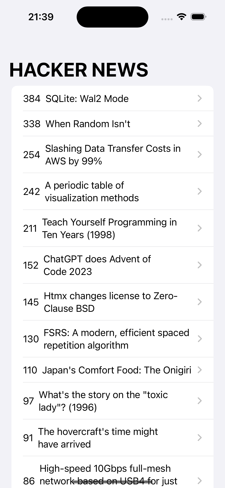
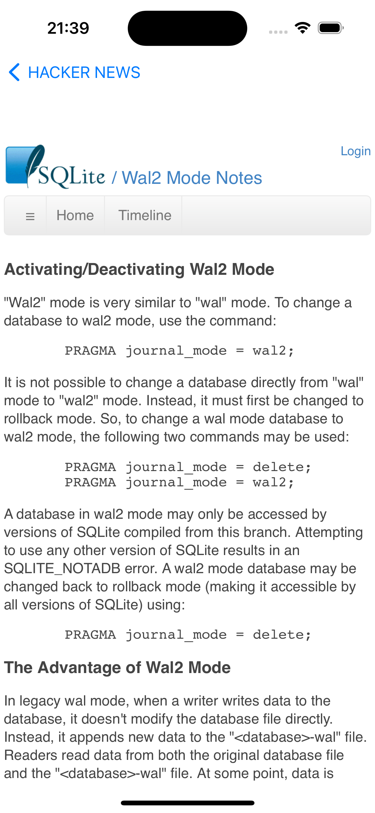

Hacker News
==========================
This is a news application written in SwiftUI which uses Algolia API

## Screenshots
 


## Features
* SwiftUI
* Algolia API
* Web Kit
* URL Request
* Networking
* JSONDecoder

## How to build

1) Clone the repository

```bash
https://github.com/GorganMihai/News-App.git
```

# Requirements 

* Xcode 13
* iOS 15.5
* Swift 5
